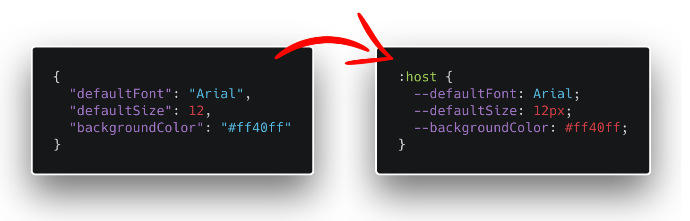

# JSON to CSS Variables



I had a project where I needed to use a REST API to store CSS settings and fetching them in my frontend, so I came up with this idea to convert a JSON object into CCS Variables and thought I would share the code.

## Installation

```bash
yarn add json-to-css-variables
```

## Usage

```javascript
  const options = {
    element: '.container',
    pretty: true
  }

  const cssString = jsonToCssVariables(json, options)
```

## Options

| Option   | Default | What it does                                     |
| -------- | ------- | ------------------------------------------------ |
| offset   | 0       | Use this to skip properties in the JSON object   |
| element  | ':host' | Where to apply the CSS variables                 |
| pretty   | false   | Should the output be prettified                  |
| unit     | 'px'    | If value is a number what unit should be applied |

## License

[MIT](LICENSE) © tcarlsen
